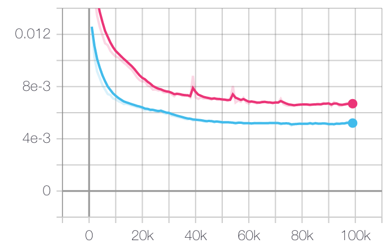

# Tacotron2 Pytorch

[](https://hits.seeyoufarm.com)


A PyTorch implementation of Tacotron2, described in [Natural TTS Synthesis By Conditioning Wavenet On Mel Spectrogram Predictions](https://arxiv.org/pdf/1712.05884.pdf), an end-to-end text-to-speech(TTS) neural network architecture, which directly converts character text sequence to speech.


- [https://github.com/kaituoxu/Tacotron2](https://github.com/kaituoxu/Tacotron2) is refereced with [pytorch_sound](https://github.com/appleholic/pytorch_sound)
- Differences

> - Use log mel spectrogram and [Waveglow Vocoder](https://github.com/NVIDIA/waveglow) to synthesize audios
> - Change dimension of tensors from (N, T, C) to (N, C, T)
>   - N : batch size, C : channels, T : time steps
> - Add stop status on inference time.
> - Add thiner pre-net to get more accurate attention.
> - And little bit different text encoder.


## Environment

- Ubuntu 16.04
- Python 3.6
- PyTorch 1.2.0
- 2 GPUs


## Install

- Install above external repos

> You should see first README.md of pytorch_sound, to prepare dataset.

```
$ pip install git+https://github.com/Appleholic/pytorch_sound
```

- Install package

```bash
$ pip install -e .
```


## Usage

- Train

```bash
$ python tacotron2_pytorch/train.py [YOUR_META_DIR] [SAVE_DIR] [SAVE_PREFIX] [[OTHER OPTIONS...]]
```

- Synthesize (one sample)
  - It writes audio, wave plot, attention and mel spectrogram image.

```bash
$ python tacotron2_pytorch/synthesize.py [TEXT] [PRETRAINED_PATH] [MODEL_NAME] [SAVE_DIRECTORY]
```

## Known Issues

- When inference time, spectrogram got several stripes. It might be occurred by hard drop out. (Not appear on training time)
- Stop token is not working well on inference time.
- Error case and resolve them: Torchhub waveglow
  - Automatically downloaded checkpoint file is crashed with using hubconf.py on [Nvidia DeepLearningExample](https://github.com/NVIDIA/DeepLearningExamples)
  - Download directly from [nvidia waveglow checkpoint 32fp code](https://github.com/NVIDIA/DeepLearningExamples/blob/0cabbfb67cb6470d80539433e0f56aee50129b2c/hubconf.py#L195), and copy that into '$HOME/.cache/torch/checkpoints'

## Results

- Total Validation Loss
  - Sum of 2 MSE Losses (linear, linear + post) and stop BCE Loss
  - red : pre net 64 dim, blue : pre net 256 dim
  - 100,000 steps



- Attention, Mel Spectrogram Sample


